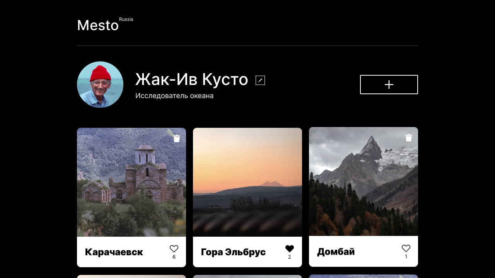

# Место ([mesto-react](https://endjoyer.github.io/mesto-react-auth/))



_- "Mesto" - это интерактивная страница, где пользователи могут делиться фотографиями. В этом репозитории находиться его версия на React. Она создана в рамках прохождения (**10-11 спринтов**) курса "веб-разработка" в Яндекс.Практикуме._

### Стек технологий:

`HTML 5`
`CSS 3`
`JavaScript (ES 6)`
`ООП`
`БЭМ (Nested)`
`React`
`git/github`

### Статус:

В разработке

### Настоящий и будущий функционал:

- Позволяет загружать новые карточки с картинкой и заголовком/ставить лайки/удалять карточки
- Кастомная валидация форм
- Зум картинок
- Редактирование информации о пользователе, и его аватара
- **Сервис подключен к серверу. Реализовано:**
  - Загрузка информации о пользователе с сервера
  - Загрузка первоначальных карточек с сервера
  - Редактирование профиля
  - Добавление новой карточки
  - Отображение количества лайков
  - Удаление карточки(можно удалять только свою)
  - Можно ставить и удалять лайки
  - Обновлять аватар

### Как установить и запустить проект:

- Клонировать репозиторий:

```console
    git clone https://github.com/endjoyer/mesto-react-auth.git
```

- Собрать проект Вебпаком:

```console
    npm run build
```

- Запустить проект на локальном сервере:

```console
    npm run start
```

### Ссылка на сайт:

https://endjoyer.github.io/mesto-react-auth/

[Ссылка на макет в Figma](https://www.figma.com/file/3YKkZfiSS1K8s44YUQTLyJ/JavaScript.-Sprint-9?node-id=109%3A2&t=7tlU9OiVAkQQ1eAp-0)

### Планы

Следующих спринтах обучения в проекте будет реализован авторизация и др..
